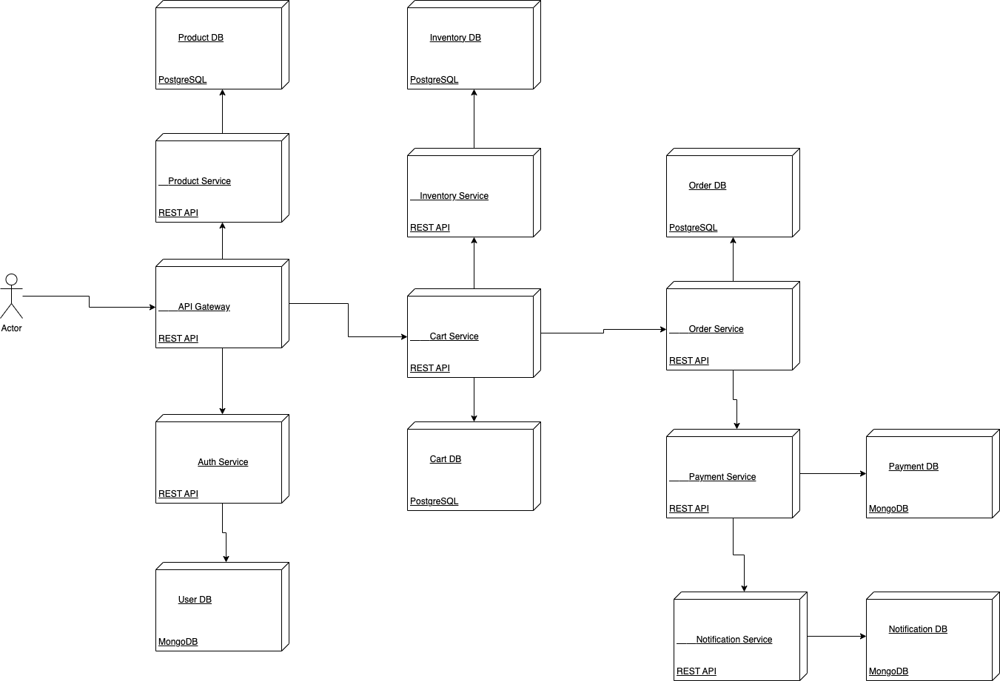
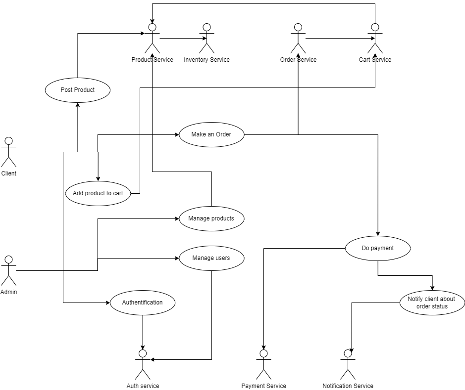

# MVWebshop

User Service:

Responsible for user registration, login, and logout.
Provides endpoints for user authentication and authorization.
Manages user profiles and credentials.

Product Service:

Handles product management and catalog functionalities.
Allows sellers to create, update, and delete product listings.
Provides endpoints for browsing and searching products.
Cart Service:

Manages the user's shopping cart.
Enables adding, removing, and updating items in the cart.
Calculates the total price and applies discounts.

Order Service:

Handles order placement and management.
Allows users to place orders, view order history, and track shipment status.
Coordinates with inventory and payment services.

Inventory Service:

Manages inventory and stock levels of products.
Updates stock quantities when orders are placed or canceled.
Provides real-time availability information.

Payment Service:

Integrates with payment gateways to process payments.
Handles payment authorization, capturing, and refunding.
Sends notifications to order service upon successful payment.

Notification Service:

Sends email or push notifications to users.
Notifies users about order updates, account activities, and promotions.

Gateway Service:

Acts as an entry point for external requests.
Handles API routing and authentication.
Implements load balancing and rate limiting.
